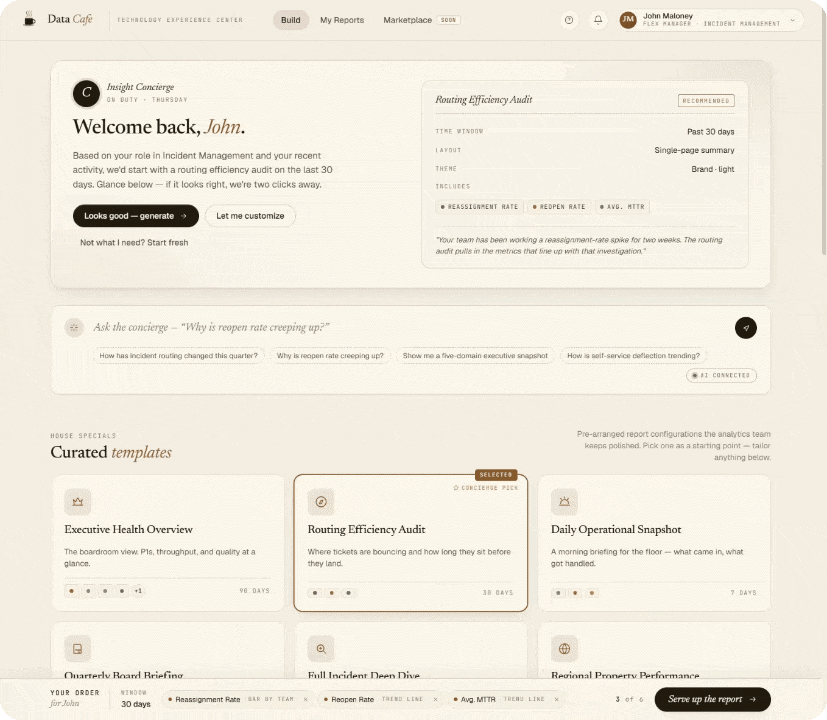
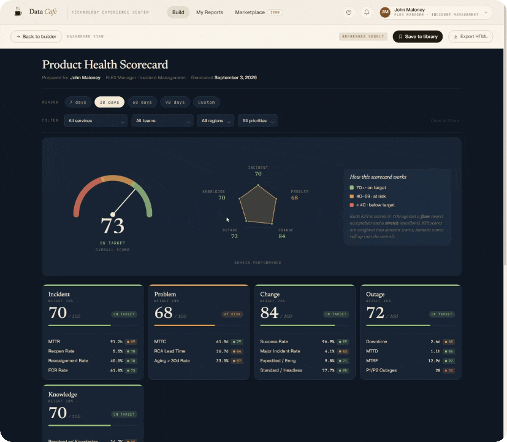

<p align="center">
  
</p>

<h1 align="center">Data Cafe — Insight Concierge</h1>

<p align="center">
  <em>From question to dashboard before your coffee gets cold.</em>
</p>

<p align="center">
  
  
</p>

> **Note on data:** every metric, chart, and KPI value shown above is generated from a synthetic, seeded dataset built for demo purposes. No production, customer, or business data is included in this repository.

---

## What this is

Insight Concierge is a self-service analytics builder that turns a persona-aware recommendation into a **fully self-contained, portable HTML report** in seconds — no BI server, no per-seat license, no network dependency to view the result. It was originally built as a hackathon prototype (Marriott TEC Codefest) to explore whether the stakeholder → developer → dashboard round-trip could be collapsed into a single, reproducible artifact.

The build materials that are Marriott-internal (pitch deck, narrative doc, cost/roadmap estimates) are intentionally **not** included in this repository. This README describes the technical architecture and implementation on its own.

## Architecture

The system is split into two independent surfaces connected by a single JSON contract — the **manifest**.

```
┌─────────────────────────┐        manifest.json        ┌──────────────────────────┐
│       Builder UI         │ ───────────────────────────▶ │     Report Generator     │
│  React 18 SPA (JSX)      │   { user, persona, intent,    │  inlines CSS + Chart.js  │
│  in-browser Babel        │     domains, metrics, time     │  + dataset + manifest    │
│  transpilation            │     window, theme, layout }   │  into one <script> blob  │
└─────────────────────────┘                              └──────────────────────────┘
                                                                       │
                                                                       ▼
                                                      single self-contained .html file
                                                      (offline-capable, ~294 KB, emailable)
```

**Surface A — Builder UI.** A React 18 single-page app authored as plain JSX and compiled client-side via `@babel/standalone` — no bundler, no build step, no CI pipeline. Seven modules load from a single HTML shell:

| Module | Responsibility |
|---|---|
| `data.jsx` | Static catalog — metrics, templates, personas, time windows, domains |
| `dataset.jsx` | Seeded synthetic time series — daily aggregates, breakdowns by service/team/region/priority, heatmap grids |
| `report-template.jsx` | The report generator — inlines Chart.js, CSS, dataset, and manifest into a single self-contained `.html` |
| `components.jsx` | Shared React component library, including the generation overlay |
| `app.jsx` | Application state, blob generation, view/download handlers |
| `tweaks-panel.jsx` | Design-time controls — theme, density, font pairing, persona override |
| `icons.jsx` | Inline SVG icon set (no external icon font/library) |

A lightweight recommendation layer infers the active persona and recent behavior on load and pre-populates a complete configuration — metrics, time window, template, theme — before the user makes a single selection.

**Surface B — the generated report.** The build step is a client-side serialization pipeline, not a server render: Chart.js (~196 KB) and all CSS are inlined, the manifest and full dataset are embedded as `<script>` blocks, and the result is packaged into a `Blob` and handed to the browser's download API. The output file has its own time-window control and re-aggregates/repaints charts entirely in-browser — verified to keep working with the network throttled to offline.

**The manifest.** Every report carries the JSON contract that produced it — user, persona, intent, domains, metrics, time window, theme, and layout — making each report traceable, cloneable, and versionable without re-deriving it from scratch.

## Tech stack & techniques

- **React 18** with JSX authored directly in the browser and transpiled on the fly via `@babel/standalone` — zero build tooling, deployable as static files
- **Client-side asset bundling** — Chart.js and all styles inlined at generation time into a single portable artifact via the `Blob` / `URL.createObjectURL` APIs
- **Manifest-driven architecture** — a single JSON contract as the source of truth between the configuration UI and the render layer, enabling reproducibility and template cloning
- **Persona-aware recommendation logic** — rule-based inference over role and recent interaction to pre-populate a complete report configuration
- **Offline-first rendering** — the generated report re-aggregates KPIs and repaints Chart.js visualizations with zero network calls after initial load
- **Hybrid NL query routing** — an "Ask Instead" natural-language box backed by a two-path router: calls an LLM API directly from the browser when a key is supplied, and falls back to a deterministic keyword/template classifier when it isn't, so the demo path never breaks
- **Theming engine** — multiple production-quality visual themes (color, type pairing, density) swappable at generation time via manifest field, with no code changes
- **State-machine driven UI** — a staged, multi-second generation sequence with progressive status messaging rather than a blocking spinner

## By the numbers

- ~7,600 lines across 7 JSX modules + report template
- 25 metrics spanning 5 ITSM-style domains (incident, change, problem, outage, knowledge)
- 9 report templates, 3 production themes
- ~294 KB average generated report size — small enough to email or archive
- 100% offline-renderable output, verified under a throttled/offline network profile

## Repository layout

```
├── Insight Concierge.html      # Entry point — loads the JSX modules via Babel standalone
├── app.jsx                     # App state, manifest assembly, blob generation
├── components.jsx              # Shared React components
├── dashboard.jsx                # Dashboard view logic
├── aggregations.jsx             # KPI aggregation / rollup logic
├── report-template.jsx          # Self-contained report generator
├── data.jsx / dataset.jsx       # Static catalog + seeded synthetic dataset
├── ask-concierge.jsx            # Hybrid NL query router (LLM + rules fallback)
├── tweaks-panel.jsx             # Design-time theme/persona controls
├── icons.jsx                    # Inline SVG icon set
├── store.jsx                    # Lightweight client-side state store
├── chart.umd.min.js             # Vendored Chart.js (inlined into generated reports)
└── docs/assets/                 # README media (logo, walkthrough GIFs)
```

## Running it locally

No build step required — it's static files served over HTTP:

```bash
python -m http.server 8771
# then open http://localhost:8771/Insight%20Concierge.html
```

(`Launch Insight Concierge.ps1` / `.cmd` wrap the same command for Windows.)

---

<p align="center"><sub>Built by John Maloney. Mock/synthetic data only — no proprietary business content included.</sub></p>
